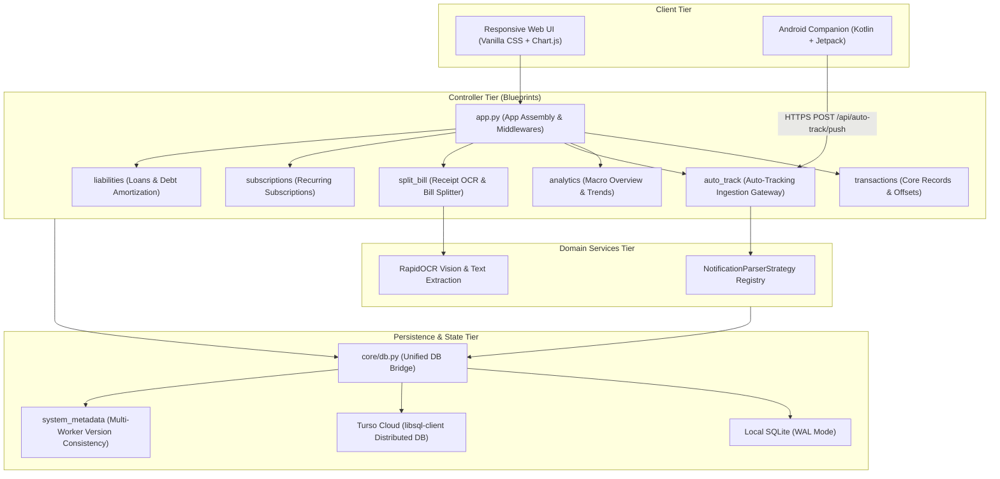

<div align="center">

# 💎 Ledger App
### Privacy-First, Intelligent & Automated Personal Finance Management System

[](file:///c:/Users/USER/Downloads/ledger-app/tests)
[](https://www.python.org/)
[](https://palletsprojects.com/p/flask/)
[](file:///c:/Users/USER/Downloads/ledger-app/android-companion)
[](https://turso.tech/)
[](https://flake8.pycqa.org/)

**Languages / 语言选择 / Pilihan Bahasa:**  
**[English](README.md)** · **[简体中文](README_zh.md)** · **[Bahasa Melayu](README_ms.md)** · **[繁體中文](README_zh_TW.md)**  
[Architecture Engineering Report (Word .docx)](file:///c:/Users/USER/Downloads/ledger-app/LEDGER_APP_ARCHITECTURE_REPORT.docx) · [Architecture Report (Markdown)](file:///c:/Users/USER/Downloads/ledger-app/docs/Ledger_App_Architecture_Report.md)

</div>

---

## 📖 Overview

**Ledger App** is an all-in-one personal finance, bookkeeping, and analytics suite designed for individuals and households who prioritize **financial privacy**, **seamless automation**, and **in-depth financial insights**.

Unlike commercial bookkeeping applications that harvest personal transaction data, serve targeted advertisements, or lock data behind proprietary cloud subscriptions, Ledger App is **100% self-hosted, open, and private**. It bridges the gap between real-world transactions and digital accounting through an **Android native background listener** and an **on-device offline RapidOCR receipt scanner**, providing a frictionless workflow from expense capture to long-term analytics.

---

## ✨ Key Features Matrix

| Module | Highlights | Technical Implementation |
| :--- | :--- | :--- |
| 📱 **Zero-Effort Auto-Tracking** | Captures payment push notifications from banks & e-wallets in real-time | Native Android `NotificationListenerService` with package whitelist filtering and HMAC Sync Token |
| 🛡️ **Extensible Parser Strategy** | Open/Closed parsing engine for Touch 'n Go, Grab, Maybank, and bank cards | Strategy Pattern (`NotificationParserStrategy`) with dynamic `@register_parser` decorator |
| 🧾 **Smart Receipt Split Bill** | Snaps or uploads dining receipts to automatically extract items, tax, and split per person | Offline RapidOCR ONNX runtime, 4-way (0°/90°/180°/270°) orientation auto-correction, and SST/service charge splitting |
| 🔄 **Repayment Expense Offset** | Paid for a group dinner and received repayments? Offset against the original expense | Automatically links incoming repayment to reduce the net expense amount, featuring sliding-window transfer deduplication |
| 📊 **Interactive Analytics** | Monthly real-time dashboard + multi-year macro trends + category breakdown | Chart.js 4.x with adaptive doughnut physical inner radius (`innerRadius`) dynamic scaling to prevent text clipping |
| 👁️ **Public Privacy Mode** | Safe to open in public places, cafes, or public transit | One-click toggle obfuscates all account balances, income, and chart amounts with high-fidelity `••••••` |
| 🌐 **4-Language Internationalization** | Complete localization across Chinese, English, Malay, and Traditional Chinese | Driven by `core/i18n.py`, unifying backend Jinja2 templates, frontend JS `window.t`, and SweetAlert2 alerts |
| ⏰ **Subscriptions & Liabilities** | Recurring bill alerts, installment amortization schedules, and net worth tracking | Flexible scheduling (weekly, monthly, quarterly, yearly), interest rate computation, and debt payoff tracking |

---

## 🏗️ System Architecture

Ledger App enforces a clean **Layered Architecture** adhering to **Thin Controller** and **Explicit Dependency Injection** principles:



---

## 🚀 Quick Start Guide

### Prerequisites
- **Python 3.12+**
- Git

### 1. Local Development Setup

```bash
# 1. Clone the repository
git clone https://github.com/siangloh/ledger-app.git
cd ledger-app

# 2. Create and activate a Python virtual environment
python -m venv .venv

# Windows:
.venv\Scripts\activate
# Linux / macOS:
# source .venv/bin/activate

# 3. Install required dependencies
pip install -r requirements.txt

# 4. Start the development server (Defaults to http://127.0.0.1:5000)
python app.py
```

### 2. Docker Container Deployment

```bash
# Build the Docker container image
docker build -t ledger-app .

# Run the container with a persistent data volume
docker run -d \
  -p 5000:5000 \
  -v $(pwd)/data:/app/instance \
  --name ledger-app-container \
  ledger-app
```

### 3. One-Click Cloud Deployment (Render.com)

The repository includes a ready-to-use `render.yaml` infrastructure-as-code specification. Simply import your GitHub fork into [Render.com](https://render.com) to deploy a live instance with managed disks.

---

## 📱 Android Companion App Setup

1. Build or download the latest Android Companion APK (located at [static/download/ledger-app.apk](file:///c:/Users/USER/Downloads/ledger-app/static/download/ledger-app.apk)).
2. Install the APK on your Android device and grant **Notification Access** permissions in system settings.
3. Open Ledger App Web UI, navigate to **Settings**, and generate a unique **API Sync Token**.
4. Enter your deployed server URL (e.g., `https://your-ledger-domain.com`) and the token into the Android app.
5. All supported bank payment notifications will automatically sync to your ledger in real-time!

---

## ⚙️ Environment Variables

| Variable | Default | Description |
| :--- | :--- | :--- |
| `FLASK_ENV` | `production` | Environment mode (`development` or `production`) |
| `SECRET_KEY` | Auto-generated | Session signing key (specify a fixed key in production) |
| `TURSO_DATABASE_URL` | Empty (Local SQLite) | Turso database URL for cloud replication (`libsql://...`) |
| `TURSO_AUTH_TOKEN` | Empty | Authentication token for Turso Cloud |
| `PORT` | `5000` | Application HTTP listening port |

---

## 🧪 Testing & CI/CD Quality Gates

This repository strictly complies with the local verification gates specified in [AGENTS.md](file:///c:/Users/USER/Downloads/ledger-app/AGENTS.md):

```bash
# 1. Code quality and syntax gate (Zero errors permitted)
flake8 . --count --select=E9,F63,F7,F82,F401,F841 --show-source --statistics

# 2. Automated test suite (104 unit and integration tests)
pytest
```

---

## 📄 In-Depth Architecture Report

A comprehensive engineering report covering system topology, the strategy engine, RapidOCR preprocessing, multi-worker concurrency, and security is available in both Word and Markdown formats:

- **Microsoft Word Document (.docx)**: [LEDGER_APP_ARCHITECTURE_REPORT.docx](file:///c:/Users/USER/Downloads/ledger-app/LEDGER_APP_ARCHITECTURE_REPORT.docx)
- **Markdown Document (.md)**: [docs/Ledger_App_Architecture_Report.md](file:///c:/Users/USER/Downloads/ledger-app/docs/Ledger_App_Architecture_Report.md)

---

## 🌐 Language Options

- **English**: [README.md](README.md) (Current)
- **简体中文 (Simplified Chinese)**: [README_zh.md](README_zh.md)
- **Bahasa Melayu (Malay)**: [README_ms.md](README_ms.md)
- **繁體中文 (Traditional Chinese)**: [README_zh_TW.md](README_zh_TW.md)

---

## 📄 License

This project is open-sourced under the **MIT License**.
