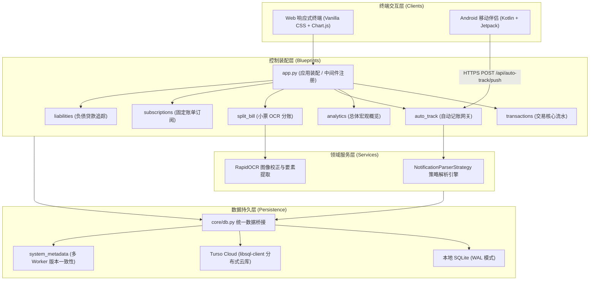

<div align="center">

# 💎 Ledger App
### 现代隐私优先 · 智能自动化个人记账与财务分析系统
**Privacy-First, Self-Hosted Personal Bookkeeping & Analytics Platform**

[](file:///c:/Users/USER/Downloads/ledger-app/tests)
[](https://www.python.org/)
[](https://palletsprojects.com/p/flask/)
[](file:///c:/Users/USER/Downloads/ledger-app/android-companion)
[](https://turso.tech/)
[](https://flake8.pycqa.org/)

[English](README.md) · [简体中文](README.md) · [架构工程报告 (Word & MD)](file:///c:/Users/USER/Downloads/ledger-app/docs/Ledger_App_Architecture_Report.md)

</div>

---

## 📖 项目简介 (Overview)

**Ledger App** 是一套专为注重个人财务隐私、追求极简高效与深度分析的用户打造的全功能智能记账系统。  
区别于传统商业记账软件充斥广告、强制联网云端、存在数据倒卖隐患的问题，本系统提供 **100% 数据自主掌控（Self-Hosted）**，并结合 **Android 原生后台监听** 与 **本地离线 RapidOCR 图像引擎**，实现了从出账捕获、智能分账、预算监控到长周期宏观分析的完整闭环。

---

## ✨ 核心特性矩阵 (Key Features)

| 模块 | 功能亮点 | 架构与实现方案 |
| :--- | :--- | :--- |
| 📱 **无感自动记账** | 监听各大银行、电子钱包支付通知并秒级自动录入 | 基于 Android 原生 `NotificationListenerService`，配置应用白名单与防重放 API Token |
| 🛡️ **开闭策略解析器** | 针对 Touch 'n Go, Grab, Maybank 等渠道推行策略模式 | 采用策略模式 (`NotificationParserStrategy`) 与 `@register_parser` 自动注册，杜绝巨型 `if/elif` |
| 🧾 **小票 AA 智能分账** | 拍小票自动提取品名单价、税率并一键多人分摊 | 基于轻量 RapidOCR ONNX 推理，独创 0°/90°/180°/270° 自适应朝向纠偏与 SST/服务费拆分 |
| 🔄 **朋友还款支出冲抵** | 垫资聚餐后朋友还钱？一键冲抵原消费记录 | 自动关联原支出扣减实付金额，联动重算结余，具备滑动时间窗口防内部自转误判机制 |
| 📊 **交互式仪表盘** | 月度即时概览 + 总体历史宏观趋势图 + 分类占比 | 基于 Chart.js 4.x 构建，独创基于物理内径的环形图中心文本自适应防遮挡算法 |
| 👁️ **隐私脱敏模式** | 在公共场合随时打开，无需担忧周围视线 | 一键开启隐私模式，所有账户余额、图表数字即时替换为高保真 `••••••` |
| 🌐 **四语无缝国际化** | 全站覆盖中、英、马、繁四种主流语言 | 由 `core/i18n.py` 驱动，前端与后端渲染无死角动态国际化 (`window.t`) |
| ⏰ **固定收支与债务** | 订阅账单提前预警、分期还款进度可视化 | 支持按周/月/季/年自动计算扣款日与年化利息负债总览 |

---

## 🏗️ 整体分层架构 (Architecture)

系统严格遵循现代化分层架构原则，杜绝跨层耦合与胖控制器：



---

## 🚀 快速开始 (Quick Start)

### 1. 本地环境运行 (Python 3.12+)

```bash
# 1. 克隆代码仓库
git clone https://github.com/siangloh/ledger-app.git
cd ledger-app

# 2. 创建并激活虚拟环境
python -m venv .venv
# Windows:
.venv\Scripts\activate
# Linux / macOS:
# source .venv/bin/activate

# 3. 安装项目依赖
pip install -r requirements.txt

# 4. 启动服务 (默认监听 http://127.0.0.1:5000)
python app.py
```

### 2. Docker 容器化运行

```bash
# 构建 Docker 镜像
docker build -t ledger-app .

# 启动容器并挂载数据持久化卷
docker run -d \
  -p 5000:5000 \
  -v $(pwd)/data:/app/instance \
  --name my-ledger \
  ledger-app
```

### 3. 云端一键部署 (Render.com)

仓库内已内置 `render.yaml` 基础设施配置，直接在 Render.com 导入 GitHub 仓库即可完成开箱即用部署。

---

## 📱 Android 伴侣端配置 (Android Companion)

1. 在 Android 手机上安装 `android-companion` 编译生成的 APK（可在 [static/download/ledger-app.apk](file:///c:/Users/USER/Downloads/ledger-app/static/download/ledger-app.apk) 下载最新版）。
2. 在手机系统设置中授予 **通知使用权 (Notification Access)**。
3. 打开 Web 端系统设置页面，生成专属 **API Sync Token**。
4. 在 Android 伴侣端输入服务地址（如 `https://your-ledger-domain.com`）与该 Token 即可全天候静默同步！

---

## 🛠️ 配置环境变量 (Environment Variables)

| 变量名 | 默认值 | 说明 |
| :--- | :--- | :--- |
| `FLASK_ENV` | `production` | 运行环境模式 (`development` / `production`) |
| `SECRET_KEY` | 自动生成 | 用于会话加密的密钥（生产环境建议自定义固定值） |
| `TURSO_DATABASE_URL` | 空 (默认本地 SQLite) | Turso 数据库连接 URL（如需使用分布式云库填写） |
| `TURSO_AUTH_TOKEN` | 空 | Turso 鉴权 Token |
| `PORT` | `5000` | 服务监听端口 |

---

## 🧪 自动化测试与质量门禁 (CI/CD Quality Gates)

本项目严格执行 [AGENTS.md](file:///c:/Users/USER/Downloads/ledger-app/AGENTS.md) 规定的代码质量与测试门禁：

```bash
# 1. 静态代码质量审查 (严禁引入未定义变量、未用包与语法错误)
flake8 . --count --select=E9,F63,F7,F82,F401,F841 --show-source --statistics

# 2. 运行端到端自动化测试套件 (覆盖 104 项单元测试与集成测试)
pytest
```

---

## 📄 架构工程报告 (Word & Markdown Format)

系统提供详细的架构白皮书与工程设计报告供深度审阅与汇报：
- **Word 格式报告**：[LEDGER_APP_ARCHITECTURE_REPORT.docx](file:///c:/Users/USER/Downloads/ledger-app/LEDGER_APP_ARCHITECTURE_REPORT.docx) (或位于 [docs/](file:///c:/Users/USER/Downloads/ledger-app/docs))
- **Markdown 在线阅读**：[docs/Ledger_App_Architecture_Report.md](file:///c:/Users/USER/Downloads/ledger-app/docs/Ledger_App_Architecture_Report.md)
- **报告生成脚本**：[scripts/generate_docx_report.py](file:///c:/Users/USER/Downloads/ledger-app/scripts/generate_docx_report.py)

---

## 🛡️ 开源协议 (License)

本项目遵循 **MIT License** 开源授权。
