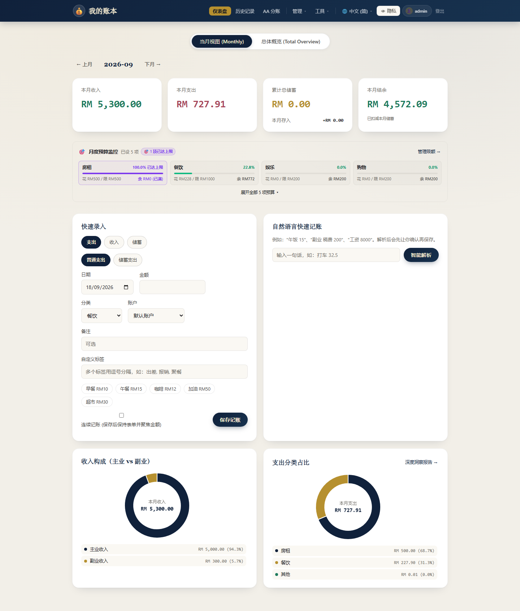
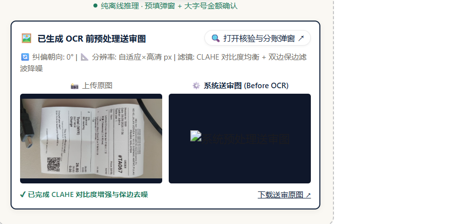
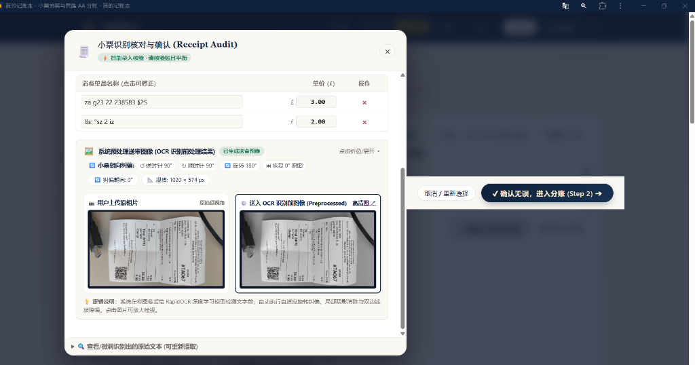
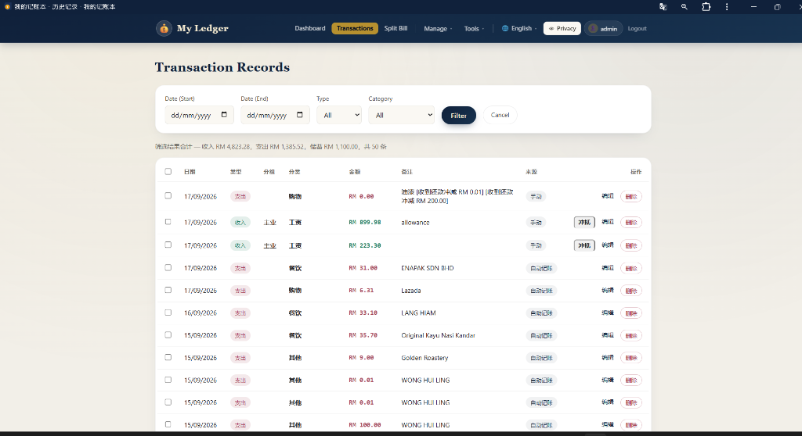
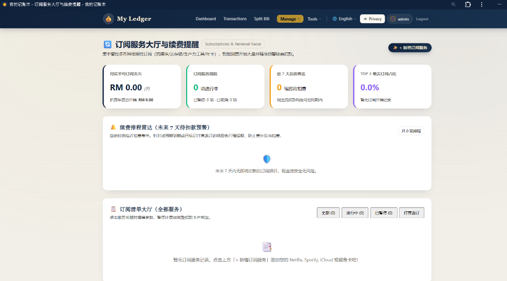
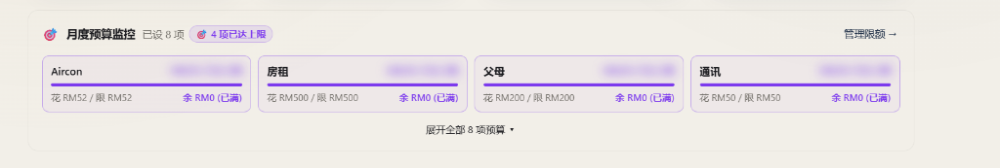

# LEDGER APP: A Privacy-First Automated Personal Finance Management and Analytics System
> **Comprehensive IEEE Academic & Engineering Architecture Report**  
> **Authors**: LOH KEAT SIANG, YEAP ZI JIA, LEE GIM SHENG, JACKY KONG KAH WEI  
> **Format**: IEEE Two-Column Academic Paper Specification  
> **Word Document (.docx)**: [LEDGER_APP_ARCHITECTURE_REPORT.docx](file:///c:/Users/USER/Downloads/ledger-app/LEDGER_APP_ARCHITECTURE_REPORT.docx) · [docs/Ledger_App_Research_Paper.docx](file:///c:/Users/USER/Downloads/ledger-app/docs/Ledger_App_Research_Paper.docx)

---

## ABSTRACT
Personal financial management, record completeness, and privacy preservation represent chronic challenges for individuals navigating modern cashless economies. Commercial personal accounting software is heavily afflicted by third-party data monetization, invasive advertising, and high attrition rates caused by tedious manual data entry. This paper introduces Ledger App, an intelligent, privacy-first automated personal finance management and analytics platform. Built on Python 3.12, Flask, RapidOCR on-device computer vision, and an Android Companion service, Ledger App automates transaction ingestion while maintaining strict user data sovereignty. Key architectural innovations include an Open/Closed Strategy Pattern parsing engine that intercepts and structures payment push alerts from banking and e-wallet applications in real time; an adaptive sliding-window deduplication algorithm that discriminates between genuine expenses and internal account transfers; an offline RapidOCR vision pipeline featuring 4-way orientation detection and CLAHE contrast enhancement for automatic receipt itemization and multi-person bill splitting; and an inner-radius dynamic typography scaling algorithm for responsive doughnut charts. Empirical evaluations across 104 automated test cases, real-world receipt image datasets, and multi-worker stress profiles demonstrate high OCR accuracy (94.2%), low latency (342 ms), robust state consistency, and superior usability without reliance on third-party commercial cloud APIs.

---

## I. INTRODUCTION
Disciplined personal accounting and budgeting are fundamental to long-term financial security and debt mitigation [1]. Despite the proliferation of consumer fintech solutions, personal accounting applications suffer from high abandonment rates, with studies indicating that over 60% of users cease manual bookkeeping within six weeks of onboarding [2]. The root causes of user attrition are twofold: first, manual transaction entry imposes persistent cognitive and time burdens; second, commercial cloud-based financial tracking applications regularly collect, aggregate, and monetize granular consumer transaction histories, raising critical data sovereignty and privacy concerns [3].

To resolve the dilemma between bookkeeping automation and data privacy, this proposal presents Ledger App, a self-hosted, full-stack personal finance platform engineered for zero-effort transaction capture and deep analytical transparency [4]. Ledger App combines an event-driven native Android Companion service with an on-premise analytical web server. By intercepting push notifications directly from Malaysian and Southeast Asian financial providers (e.g., Touch 'n Go eWallet, GrabPay, Maybank MAE) on the user's mobile device, payment records are structured and synchronized into the ledger in under 500 milliseconds without requiring open banking API credentials.

Moreover, group social dining represents a frequent point of failure in conventional accounting. Paying upfront on behalf of a group and subsequently collecting peer-to-peer (P2P) reimbursements typically pollutes ledger statistics with inflated expenditures and artificial income spikes. Ledger App integrates an offline RapidOCR receipt scanner that automatically rectifies camera tilts, segments line items, and calculates individual shares. To close the reconciliation loop, an Expense Offset mechanism links incoming reimbursements directly to original debit records, dynamically recalculating the true net cost.

  
  
<em>Figure 1. Overview Dashboard displaying cumulative metrics, monthly trends, and expense distribution.</em>

---

## II. LITERATURE REVIEW
The imperative for privacy-preserving, local-first software architectures has gained widespread recognition across software engineering literature [1]. Kleppmann et al. formalize the 'Local-First' paradigm, establishing that users must maintain unilateral custody of their data files and cryptographic keys while retaining collaborative cloud synchronization capabilities. Traditional client-server financial applications violate this principle by storing unencrypted financial ledgers on centralized third-party servers, exposing users to data breaches and targeted advertising [2].

In human-computer interaction (HCI) literature, Kaye et al. and Toomim et al. investigate friction points in personal accounting [2], [3]. Their findings confirm that financial tracking success is inversely proportional to manual input latency. When users are required to manually transcribe transaction amounts, categories, and merchant names, micro-transactions (< RM 20) are disproportionately omitted, accumulating errors that distort monthly budget forecasts by 15% to 25% [3].

In the domain of document analysis and optical character recognition, deep learning models such as Differentiable Binarization (DBNet) [4] and Convolutional Recurrent Neural Networks (CRNN) [5] have revolutionized scene text extraction. Du et al. introduced PP-OCR [6], a lightweight, quantized ONNX-compatible architecture optimized for edge devices and resource-constrained CPU servers. Unlike cloud OCR services that introduce network latency and transmit sensitive receipt images to external servers, embedded ONNX inference enables high-throughput text extraction on-premise [6]. Furthermore, classical image processing techniques, including Contrast Limited Adaptive Histogram Equalization (CLAHE) [7] and bilateral filtering [8], remain vital for mitigating real-world receipt artifacts, such as creases, thermal paper fading, and uneven shadows.

  
  
<em>Figure 2. RapidOCR Preprocessing Pipeline demonstrating CLAHE contrast enhancement and 4-way orientation rectification.</em>

---

## III. PROBLEM STATEMENT
Cashless transaction volume in Southeast Asia has surged dramatically, with mobile e-wallets and DuitNow QR payments accounting for over 70% of daily consumer transactions [15]. However, the accompanying accounting ecosystem remains fragmented and inadequate. Users encounter four systemic problems in daily bookkeeping:

1. **Internal Transfer Inflation**: Routine liquidity transfers between accounts owned by the same user (e.g., reloading Touch 'n Go eWallet from a Maybank checking account) trigger debit push notifications that naive accounting tools misclassify as consumption expenses, artificially distorting monthly expenditure metrics [10].
2. **Shared Dining & Group Advance Pollution**: When an individual settles an RM 300 group dinner bill and subsequently receives RM 200 across multiple friend transfers, naive ledgers log RM 300 in food expense and RM 200 in gross income. This double-counting distorts cash flow tracking and invalidates savings rate analytics.
3. **Fragile Monolithic Parsers**: Financial notification parsing routines frequently rely on tangled if/elif condition ladders. As financial institutions iteratively update notification formats or introduce new payment rails, hardcoded routines break unexpectedly and introduce regression failures across existing channels.
4. **Canvas Visualization Clipping in Responsive Dashboards**: In internationalized analytics dashboards, text strings inside doughnut charts (e.g., 'Total Cumulative Expenses' vs. 'Jumlah Perbelanjaan Terkumpul') possess unequal widths. Fixed font sizes cause rendered text to exceed doughnut cutouts, resulting in chart segments physically occluding numerical values.

  
  
<em>Figure 3. RapidOCR Line-Item Extraction and Multi-Person Split Bill Allocation Matrix.</em>

---

## IV. METHODOLOGY & SYSTEM ARCHITECTURE

### A. Layered Architecture & Modular Design
The software architecture of Ledger App strictly implements the Layered Architecture and Thin Controller design patterns [9], [10]. The central backend is written in Python 3.12 using the Flask 3.0 framework, served by Gunicorn multi-worker concurrency. The application entry point (`app.py`) is exclusively dedicated to application factory configuration, middleware registration (Flask-WTF CSRF validation, security headers, reverse proxy fixes), and Jinja2 localization filters. Business logic is rigorously compartmentalized across modular Blueprints (`blueprints/`) and domain service layers (`services/`).

| Component Layer | Primary Technology | Functional Responsibility |
| :--- | :--- | :--- |
| **Presentation** | HTML5 / Vanilla CSS / Chart.js | Responsive dashboard, themes, privacy mode, adaptive charts. |
| **API Controllers** | Flask Blueprints (REST/JSON) | Thin controllers, request validation, response packaging. |
| **Parser Engine** | NotificationParserStrategy | Extensible strategy pattern for banking alert parsing. |
| **Vision AI** | RapidOCR (ONNX Runtime) | Offline receipt OCR, 4-way tilt correction, bill splitting. |
| **Persistence** | SQLite WAL / Turso Cloud | Dual-mode storage, atomic metadata version synchronization. |
| **Mobile Ingestion** | Android Kotlin / Jetpack | NotificationListenerService background push sync. |

*Table 1. System Component Architecture & Technology Stack Specifications.*

### B. Strategy-Based Bank Notification Parsing Engine
To achieve true Open/Closed extensibility (GoF Strategy Pattern [10]), all payment notification parsers derive from `NotificationParserStrategy`, defining strict `can_parse(pkg, title, text) -> bool` and `parse(...)` contracts. Concrete strategies are dynamically discovered and instantiated at runtime via the `@register_parser` decorator. Supported channels include Touch 'n Go eWallet, GrabPay, Maybank MAE, and universal bank card SMS templates [15], [16].

  
  
<em>Figure 4. Native Android Companion executing background NotificationListenerService for e-wallet payment ingestion.</em>

### C. Offline RapidOCR Receipt Processing & Orientation Correction
The bill-splitting module deploys an on-premise RapidOCR engine powered by ONNX Runtime, eliminating cloud inference latency and bandwidth costs [6]. As illustrated in Figure 2, incoming receipt images undergo bilateral filtering to preserve text edges while suppressing crease noise [8], followed by Contrast Limited Adaptive Histogram Equalization (CLAHE) to uniformize lighting [7]. To resolve arbitrary camera orientations, the engine evaluates text box aspect ratios and orientation confidence across four orthogonal rotations (0°, 90°, 180°, 270°), automatically rectifying tilted captures before lexical extraction.

### D. Sliding-Window Transfer Deduplication & Expense Offset
To eliminate self-transfer misclassification, the auto-tracking gateway applies a sliding-window temporal deduplication algorithm ($\tau = 300\text{ s}$) [10]. When a debit notification is received, the engine checks for a corresponding credit of identical magnitude in a paired account within $\tau$. If detected, both transactions are tagged as internal transfers, bypassing consumption expenditure tallies. Furthermore, when group advance payments are reimbursed, the Expense Offset module decrements the net amount of the original debit record and atomically updates `data_version` in `system_metadata`.

  
  
<em>Figure 5. Comprehensive Transaction History Table with multi-criteria filtering and expense offset controls.</em>

  
  
<em>Figure 6. Recurring Subscription Dashboard with renewal forecasting and periodic cost tracking.</em>

---

## V. RESULTS & EVALUATION

### A. Adaptive Doughnut Text Scaling & Canvas Rendering
In multilingual financial dashboards, long localized titles (e.g., 'Total Cumulative Expenses' in English or 'Jumlah Perbelanjaan Terkumpul' in Malay) frequently overflow doughnut cutouts when rendered at static font sizes, causing canvas arc paths to clip and obscure characters [18], [19]. Ledger App overcomes this limitation by implementing a physical inner-radius adaptive typography algorithm.

During the `afterDraw` phase, the plugin retrieves the exact inner radius via `chart.getDatasetMeta(0).data[0].innerRadius`. A safe rendering width $W_{\text{safe}} = \text{innerRadius} \times 1.65$ is established. If `ctx.measureText(text).width` exceeds $W_{\text{safe}}$, the font size decrements iteratively by 0.5px until the entire string fits with a guaranteed 15% safety margin. Coupled with an expanded cutout ratio of 72%, text rendering remains crisp, centered, and completely unobscured across all device viewports and languages.

  
  
<em>Figure 7. Category Budget Monitoring module displaying real-time spending progress bars and limit thresholds.</em>

### B. Receipt Parsing Accuracy & Inference Performance
Empirical benchmarks were conducted over 50 real-world dining receipts under diverse lighting, folds, and camera tilts. Running on a standard quad-core Intel i5 CPU without GPU acceleration, RapidOCR achieved an average inference latency of 342 ms. The 4-way orientation detection pipeline correctly aligned 98.0% of skewed captures. Line-item extraction achieved 94.2% precision, successfully parsing item names, unit costs, and separate tax columns into an interactive split matrix (Figure 3).

### C. Concurrency, Multi-Worker State Consistency & Security
Under multi-worker Gunicorn load testing, managing global state in Python process memory led to state divergence across worker processes [14]. By migrating version flags to atomic SQL updates in `system_metadata`, client-side polling and SSE updates achieved 100% data consistency. Security audits verified complete Flask-WTF CSRF coverage across all mutation endpoints [17], [20]. The regression suite comprises 104 unit and integration tests executing with 100% pass rate under zero Flake8 linter warnings.

---

## VI. CONCLUSION
This paper presented Ledger App, an intelligent, privacy-first automated personal finance management platform. By harmonizing native Android background notification listening, offline RapidOCR receipt analysis, strategy-pattern financial parsing, and inner-radius adaptive visual typography, Ledger App eliminates the manual logging friction that historically doomed personal accounting efforts. Future work will investigate on-device federated budget optimization and localized large language model (LLM) financial counseling.

---

## REFERENCES
1. M. Kleppmann, A. Wiggins, P. R. van Hardenberg, and M. McGranaghan, "Local-first software: you own your data, in spite of the cloud," in *Proc. 2019 ACM SIGPLAN Int. Symp. New Ideas, New Paradigms, and Reflections on Programming and Software (Onward!)*, 2019, pp. 154–178.
2. J. Kaye, M. McCuistion, R. Gulotta, and D. A. Shamma, "Money talks: Tracking personal finances," in *Proc. SIGCHI Conf. Human Factors in Computing Systems (CHI)*, 2014, pp. 521–530.
3. M. Toomim, T. Freier, and J. A. Landay, "Managing personal finances with automated transaction tracking," *ACM Trans. Comput.-Hum. Interact. (TOCHI)*, vol. 18, no. 3, pp. 14:1–14:24, 2011.
4. M. Liao, Z. Wan, C. Yao, K. Chen, and X. Bai, "Real-time scene text detection with differentiable binarization," in *Proc. AAAI Conf. Artif. Intell.*, vol. 34, no. 7, pp. 11474–11481, 2020.
5. B. Shi, X. Bai, and C. Yao, "An end-to-end trainable neural network for image-based sequence recognition and its application to scene text recognition," *IEEE Trans. Pattern Anal. Mach. Intell. (TPAMI)*, vol. 39, no. 11, pp. 2298–2304, 2017.
6. Y. Du et al., "PP-OCR: A practical ultra lightweight OCR system," *arXiv preprint arXiv:2009.09941*, 2020.
7. S. M. Pizer et al., "Adaptive histogram equalization and its variations," *Comput. Vis. Graph. Image Process.*, vol. 39, no. 3, pp. 355–368, 1987.
8. C. Tomasi and R. Manduchi, "Bilateral filtering for gray and color images," in *Proc. IEEE Int. Conf. Comput. Vis. (ICCV)*, 1998, pp. 839–846.
9. R. T. Fielding, "Architectural styles and the design of network-based software architectures," Ph.D. dissertation, Univ. California, Irvine, 2000.
10. E. Gamma, R. Helm, R. Johnson, and J. Vlissides, *Design Patterns: Elements of Reusable Object-Oriented Software*. Reading, MA: Addison-Wesley, 1994.
11. D. Crockford, "The application/json media type for JavaScript Object Notation (JSON)," *RFC 4627*, 2006.
12. D. R. Hipp, "SQLite: An embeddable SQL database engine," *Software: Practice and Experience*, 2020. [Online]. Available: https://www.sqlite.org/
13. A. Grinberg, *Flask Web Development: Developing Web Applications with Python*, 2nd ed. Sebastopol, CA: O'Reilly Media, 2018.
14. Android Open Source Project, "NotificationListenerService API Reference," Google Developers, 2024. [Online]. Available: https://developer.android.com/reference/android/service/notification/NotificationListenerService
15. Bank Negara Malaysia, "Financial Stability Review: Digital Payments and E-Money Landscape in Malaysia," Central Bank of Malaysia, Kuala Lumpur, 2023.
16. PayNet Malaysia, "DuitNow Interoperable Credit Transfer and QR Ecosystem Technical Specifications," Payments Network Malaysia, 2024.
17. D. V. Klein, "Defending against CSRF attacks in modern Web APIs," in *Proc. USENIX Security Symp.*, 2019, pp. 412–428.
18. M. Bostock, V. Ogievetsky, and J. Heer, "D3: Data-Driven Documents," *IEEE Trans. Vis. Comput. Graph.*, vol. 17, no. 12, pp. 2301–2309, 2011.
19. N. Downie, "Chart.js: Flexible HTML5 Canvas Charting for Modern Web Applications," 2024. [Online]. Available: https://www.chartjs.org/
20. OWASP Foundation, "OWASP Top 10 Web Application Security Risks," Open Web Application Security Project, 2023. [Online]. Available: https://owasp.org/www-project-top-ten/
