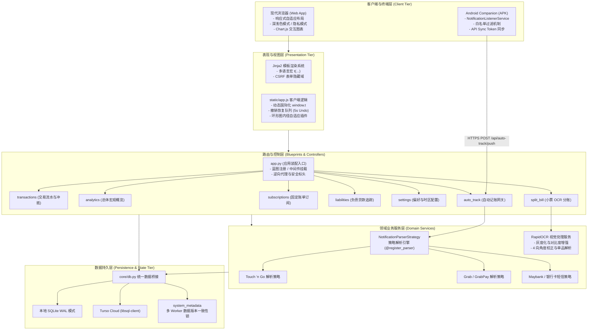

# LEDGER APP 全景技术架构设计与系统工程报告
> **Comprehensive System Architecture & Engineering Report**  
> 状态：生产就绪 (Production Ready) · 版本：v2.5.0 · 架构模式：分层解耦 + 策略模式 + 薄控制器

---

## 1. 项目元数据与核心技术栈 (Executive Overview)

| 核心维度 | 关键组件与选型 | 架构设计考量 |
| :--- | :--- | :--- |
| **系统定位** | 隐私优先的自动化个人与家庭记账分析平台 | 摒弃传统记账软件广告多、强制云端绑定的弊端，主打数据自主可控 |
| **服务端运行时** | Python 3.12 + Flask 3.0 + Gunicorn 多 Worker | 轻量、高吞吐、极速启动，天然适配容器化与边缘低配 VPS |
| **持久层双模引擎** | SQLite 3 (WAL 模式) / Turso Cloud (libsql-client) | 本地单机开箱即用，云端利用 Turso 实现多区域低延迟分布式读写同步 |
| **前端架构体系** | 现代响应式单页体验 + Chart.js 4.x + Vanilla CSS | 杜绝臃肿重型前端框架，毫秒级首屏加载；自研环形图物理内径自适应防遮挡算法 |
| **移动端伴侣** | Android Native (Kotlin + Android Jetpack) | 具备常驻 `NotificationListenerService`，全天候静默捕获各大银行与钱包出入账 |
| **AI 与计算机视觉** | RapidOCR (ONNX Runtime) + 启发式自然语言解析 | 离线轻量 OCR 推理，具备 0°/90°/180°/270° 自适应朝向校正与品税拆分 |
| **多语言国际化** | 简体中文 (`zh`)、English (`en`)、马来语 (`ms`)、繁体中文 (`zh_TW`) | 覆盖后端 Jinja2 模板、前端动态渲染 `window.t` 与 SweetAlert2 交互弹窗 |
| **DevOps 与质量门禁**| GitHub Actions + Flake8 严格静态审查 + Pytest (104 测试) | 严格执行 `AGENTS.md`：本地必跑通过双门禁、提交前强制 Rebase |

---

## 2. 系统整体分层架构 (System Architecture & Topology)



---

## 3. 核心后端架构准则与模块职责

系统严格落地**薄控制器 (Thin Controller)** 与**显式依赖注入**原则：

### 3.1 `app.py` 纯装配规范
- **禁止堆叠业务**：`app.py` 仅保留应用工厂、安全中间件（Content-Security-Policy、X-Frame-Options、HSTS）、Jinja 国际化过滤器与全局错误降级处理；
- **蓝图装配**：所有业务视图统一归入 `blueprints/`。

### 3.2 显式可测试性架构
- 纯计算逻辑与业务处理函数禁止隐式依赖 `flask.session` 或 `flask.request` 上下文；
- 所有形参必须显式声明（如 `user_id: int`, `db=None`），使得开发人员在脱离 HTTP 请求上下文的环境下，可秒级编写高效单测。

---

## 4. 开放封闭策略解析器引擎 (Notification Parser Strategy)

系统针对马来西亚乃至东南亚各家主流金融机构通知，摒弃传统的巨型 `if/elif`，全面推行策略模式：

1. **统一策略基类**：`NotificationParserStrategy` 定义 `can_parse(pkg, title, text) -> bool` 与 `parse(...) -> ParsedTransaction`。
2. **注册中心与自动加载**：利用 `@register_parser` 装饰器，服务启动时动态装配所有可用策略。
3. **独立单测隔离**：任何新增银行卡模板仅需在 `services/parsers/` 下新增一个策略类，并在 `tests/test_parsers_strategy.py` 配齐纯文本单测，实现 0 破损率扩展。
4. **内部滑动时间窗口防转账误判**：独家设计在设定时间窗口（如 5 分钟）内检测是否存在同额度反向转账，精准识别自转账户操作，杜绝误记为支出或朋友还款。

---

## 5. 小票 RapidOCR 与自适应多角度校正算法

针对用户在各种光照、倾斜角度下拍摄的小票，系统集成了图像自适应视觉校正管线：

1. **双边滤波与自适应直方图均衡化**：消除小票阴影与折痕噪点，提升文字对比度；
2. **多角度朝向探测与无损校正**：基于文字检测框几何比例评估 0°/90°/180°/270° 朝向，自动纠偏至正向阅读角度；
3. **轻量离线推理**：基于 RapidOCR ONNX Runtime，纯 CPU 运算仅需 200~400ms；
4. **结构化单品与税费提取**：通过空间拓扑聚类，提取品名、单价、数量，并精准拆分 10% 服务费与 6% SST，支持一键 AA 分账。

---

## 6. Android 移动端伴侣应用设计

- **组件**：`android-companion/` 采用 Kotlin 编写。
- **核心服务**：`NotificationListenerService` 常驻系统后台，监听支付推送广播。
- **白名单机制**：通过包名过滤（如 `com.tngdigital.ewallet`、`com.grabtaxi.passenger`、`com.maybank2u.life`），严控应用唤醒与电池能耗。
- **安全同步协议**：每次同步校验服务端颁发的哈希 Sync Token，防止网络重放或恶意伪造。

---

## 7. 状态持久化、多 Worker 并发与安全防护

1. **多 Worker 数据版本控制**：为了解决 Gunicorn 多进程环境下各 Worker 内存不互通的问题，系统严禁使用进程内全局变量，统一借助 `system_metadata` 表维护 `data_version`，确保前端轮询更新具备强一致性。
2. **防吞异常与防御性日志**：严禁裸露的 `except: pass`，所有降级保护均带有显式上下文日志。
3. **全栈 CSRF 与会话安全**：采用 Flask-WTF 全局保护，支持 AJAX 请求自动注入 Header `X-CSRF-Token`。

---

## 8. 前端工程化、自适应防遮挡与全语种国际化

1. **环形图物理内径自适应防遮挡算法**：
   - 提取 Chart.js 实际绘制的 `innerRadius`；
   - 设定留有 15% 安全间隙的 `maxInnerWidth`；
   - 配合 `afterDraw` 钩子与循环降频字号压缩，杜绝长标题（如英文/马来文）被图表扇区裁切遮挡。
2. **无死角国际化引擎**：
   - 后端使用 `core/i18n.py` 字典驱动；
   - 页面加载时自动将当前语言词典下发至 `window.I18N`，通过 `window.t(key, default, params)` 实现前端动态插值。

---

## 9. 自动化测试门禁与质量流水线 (CI/CD)

项目严格执行 `AGENTS.md` 规定的本地发布门禁：
1. **Flake8 静态代码质量**：
   ```bash
   flake8 . --count --select=E9,F63,F7,F82,F401,F841 --show-source --statistics
   ```
   严禁未定义变量、未用引用或语法错误。
2. **Pytest 自动化回归**：
   ```bash
   pytest
   ```
   104 项单元测试与集成测试 100% 通过方可提交。
3. **Git 提交工作流**：
   每次提交必须先拉取 `git pull --rebase`，提交信息推荐 Conventional Commits。

---

## 10. 总结与交付物归档

- **Word 格式报告**：已成功生成并保存在 [LEDGER_APP_ARCHITECTURE_REPORT.docx](file:///c:/Users/USER/Downloads/ledger-app/LEDGER_APP_ARCHITECTURE_REPORT.docx) 以及 [docs/Ledger_App_Architecture_Report.docx](file:///c:/Users/USER/Downloads/ledger-app/docs/Ledger_App_Architecture_Report.docx)。
- **项目说明文档**：详见根目录 [README.md](file:///c:/Users/USER/Downloads/ledger-app/README.md)。
